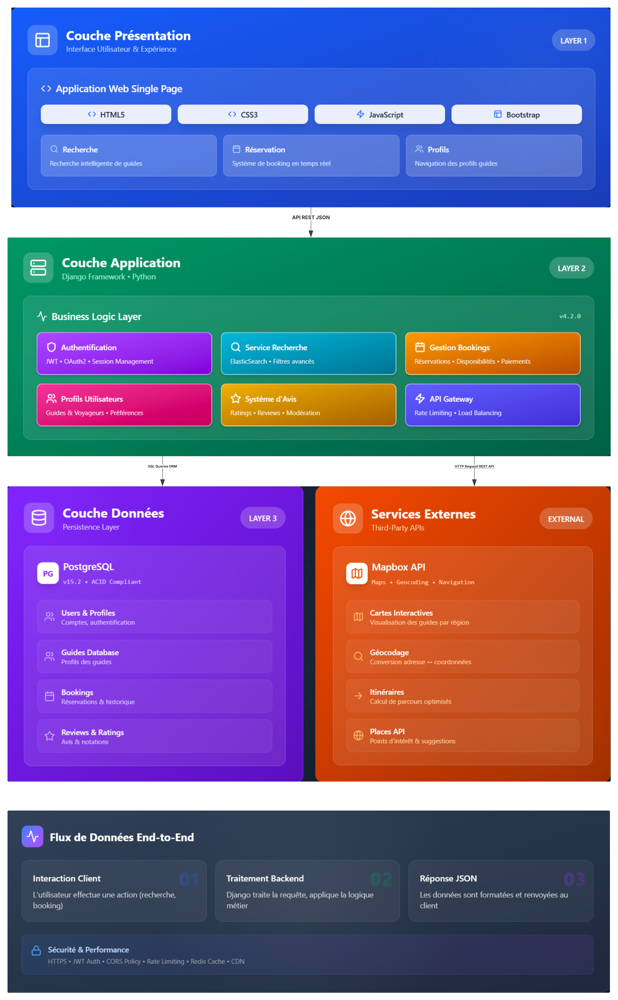
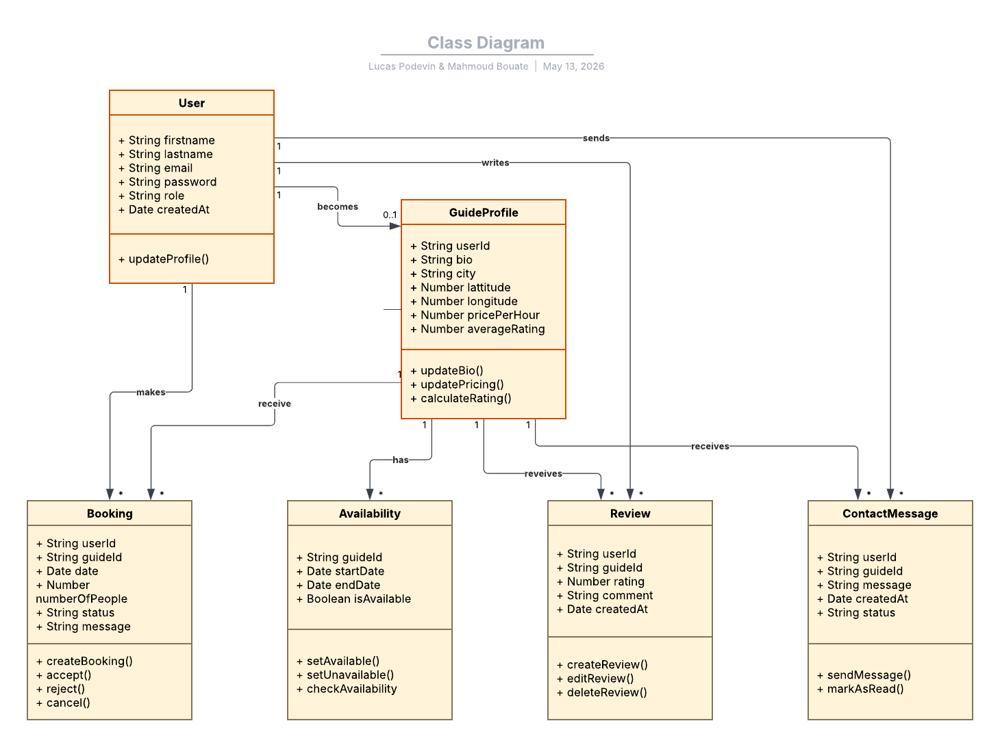
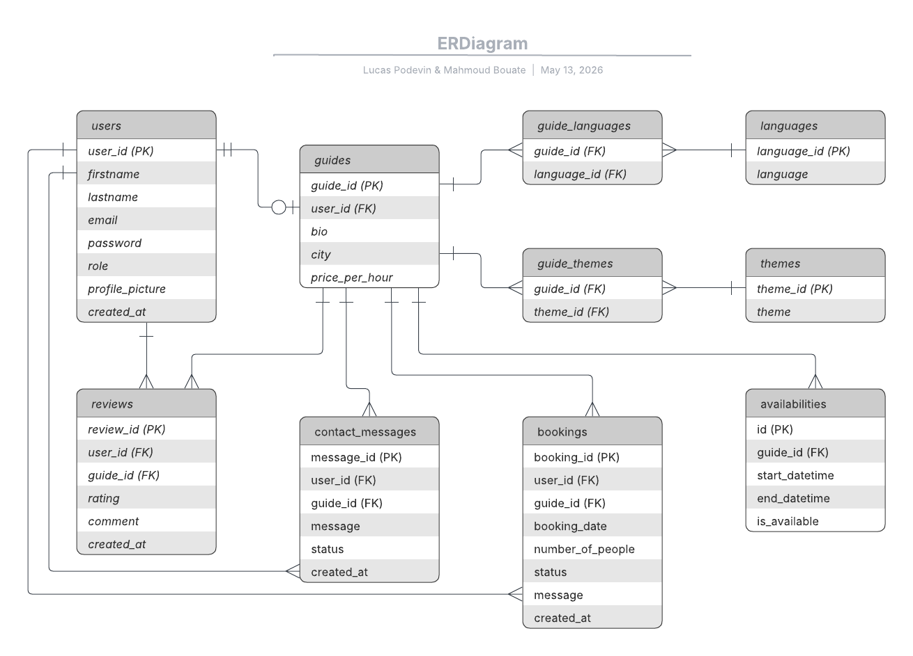
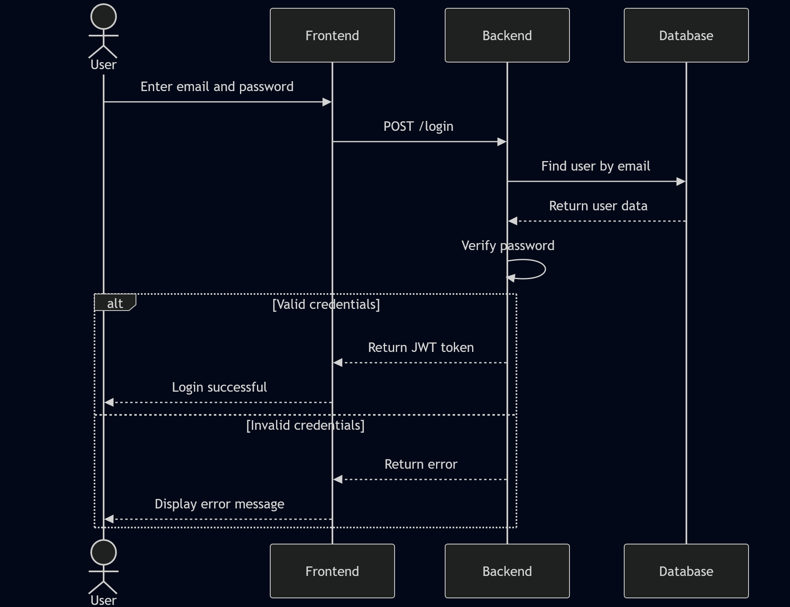
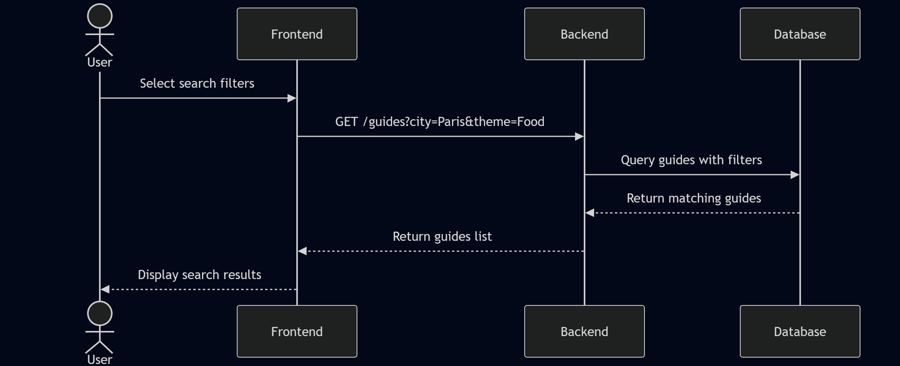
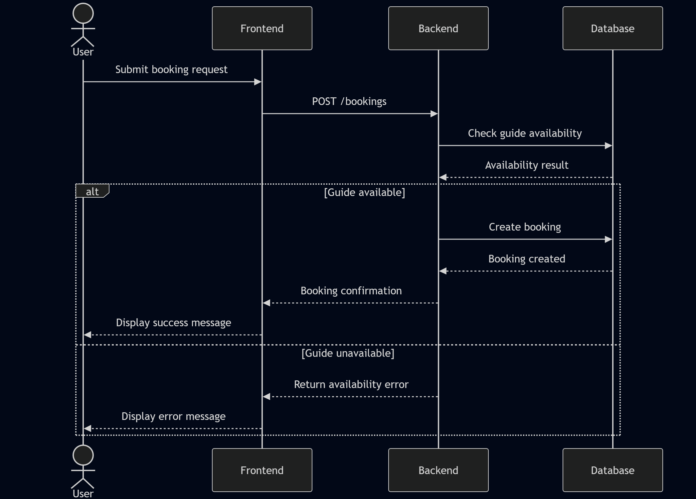

# Stage 3: Technical Documentation

## Table des matières

- [Objectives](#objectives)
- [1. User Stories + MoSCoW (Traveler)](#1-user-stories-moscow-traveler)
- [2. Guide User Stories + MoSCoW](#2-guide-user-stories-moscow)
- [3. Mockups](#3-mockups)
- [4. Diagrams](#4-diagrams)
- [5. Document External and Internal APIs](#5-document-external-and-internal-apis)
- [6. SCM Strategy](#6-scm-strategy)
- [7. QA Strategy](#7-qa-strategy)
- [8. Technical Justifications](#8-technical-justifications)

## Objectives

- Translate project objectives and requirements into a detailed technical plan.
- Define user stories and mockups to clarify functionality where applicable.
- Design and document architecture, components, classes, database structures, or collections as applicable.
- Create high-level sequence diagrams illustrating interactions between components or services.
- Specify external services (APIs) and define internal API endpoints with input and output formats.
- Plan source control management (SCM) and quality assurance (QA) strategies for code lifecycle and testing.
- Justify all technical decisions based on functional or non-functional requirements, constraints, or expert recommendations.

---

## 1 User Stories MoSCoW Traveler

### Must Have (Essential MVP Features)

- As a user, I want to register an account, so that I can access the platform. ✅
- As a user, I want to log in securely, so that I can access my personal data and bookings. ✅
- As a user, I want to search for guides using city, date, language, theme and number of people, so that I can find a suitable guide. ✅
- As a user, I want to view a guide profile, so that I can check their description, availability and reviews. ✅
- As a user, I want to send a booking request, so that I can contact a guide and request a tour. ✅
- As a user, I want to view guide availability, so that I can know when I can book. ✅
- As a user, I want to access a basic dashboard, so that I can manage my account and requests. ✅

### Should Have (Important but Not Critical)

- As a user, I want to leave a review and rating, so that I can share my experience. ✅

### Could Have (Nice-to-Have Features)

- As a user, I want to filter search results more precisely, so that I can refine my search. ✅
- As a user, I want to save favorite guides, so that I can find them later easily. ⏳
- As a user, I want to receive notifications about booking updates, so that I stay informed. ❌

### Won’t Have (Out of MVP Scope)

- Online payment system
- AI guide recommendation
- Travel blog or articles
- Certification badges for guides

---

## 2 Guide User Stories MoSCoW

### Must Have (Essential MVP Features)

- As a guide, I want to create an account, so that I can offer my services on the platform. ✅
- As a guide, I want to log in securely, so that I can manage my profile and bookings. ✅
- As a guide, I want to create and edit my profile, so that I can present my tours and information to users. ✅
- As a guide, I want to define my availability, so that users can know when I am available. ✅
- As a guide, I want to receive booking requests, so that I can accept or respond to users. ✅

### Should Have (Important but Not Critical)

- As a guide, I want to upload a profile picture, so that my profile looks more professional and trustworthy. ⏳
- As a guide, I want to view reviews from users, so that I can improve my services. ⏳

### Could Have (Nice-to-Have Features)

- As a guide, I want to receive notifications for new booking requests, so that I can respond quickly. ❌
- As a guide, I want to manage multiple tours or themes, so that I can offer more options. ❌

### Won’t Have (Out of MVP Scope)

- As a guide, I want to receive online payments directly through the platform.
- As a guide, I want to earn certification badges, so that I can increase my credibility.

---

## 3. Mockups


---

## 4. Diagrams

### Architecture Diagram



---

### Class Diagram



---

### ER Diagram



---

### Sequences Diagrams

#### Login



#### Find a Guide



#### Booking


----

## 5. Document External and Internal APIs

### 5.1 External API
#### Mapbox GL JS

| Property | Description |
|----------|-------------|
| Purpose | Display interactive maps in the frontend |
| Integration Type | Frontend JavaScript library |
| Input | Coordinates |
| Output | Interactive rendered map |

#### Integration Example

```
const map = new mapboxgl.Map({
    container: 'map',
    style: 'mapbox://styles/mapbox/streets-v12',
    center: [longitude, latitude],
    zoom: 12
});
```

### 5.2 Internal API

GuidHéHo expose a REST API that allows the frontend application to manage users, guides, bookings and reviews.

#### Authentication Endpoints
##### Register User

| Property | Description |
|----------|-------------|
| URL | ```/auth/register``` |
| Method | ```POST``` |
| Input Format | JSON |
| Output Format | JSON |

##### Example Request

```
{
    "firstname": "Mahmoud",
    "lastname": "Bouate",
    "email": "mahmoudbouate@example.com",
    "password": "password/123"
}
```

##### Example Response

```
{
    "message": "User created successfully",
    "token": "jwt_token",
    "user": {
        "id": 1,
        "firstname": "Mahmoud",
        "lastname": "Bouate",
        "email": "mahmoudbouate@example.com"
    }
}
```

##### Login User

| Property | Description |
|----------|-------------|
| URL | ```/auth/login``` |
| Method | ```POST``` |
| Input Format | JSON |
| Output Format | JSON |

##### Example Request

```
{
    "email": "mahmoudbouate@example.com",
    "password": "password/123"
}
```

##### Example Response

```
{
    "message": "Login successful",
    "token": "jwt_token",
    "user": {
        "id": 1,
        "firstname": "Mahmoud",
        "lastname": "Bouate"
    }
}
```

#### User Endpoints
##### Get User Profile

| Property | Description |
|----------|-------------|
| URL | ```/users/:id``` |
| Method | ```GET``` |
| Input Format | URL parameter |
| Output Format | JSON |

##### Example Response

```
{
    "id": 1,
    "firstname": "Mahmoud",
    "lastname": "Bouate"
}
```

##### Update User Profile

| Property | Description |
|----------|-------------|
| URL | ```/users/:id``` |
| Method | ```PATCH``` |
| Authorization | Bearer token |
| Input Format | JSON |
| Output Format | JSON |

##### Example Request

```
{
    "firstname": "Lucas",
    "lastname": "Podevin",
    "email": "lucas.podevin@example.com"
}
```

##### Example Response

```
{
    "message": "Profile updated successfully"
}
```

#### Guide Endpoints
##### Get All Guides

| Property | Description |
|----------|-------------|
| URL | ```/guides``` |
| Method | ```GET``` |
| Input Format | Query parameters |
| Output Format | JSON |

##### Example Request

```
/guides?city=Bordeaux
```

##### Example Response

```
[
    {
    "id": 1,
    "firstname": "Pierre",
    "lastname": "Palmade",
    "price": 40,
    "rating": 4.8
    },
    ...
]
```

##### Get Guide Details

| Property | Description |
|----------|-------------|
| URL | ```/guides/:id``` |
| Method | ```GET``` |
| Input Format | URL parameter |
| Output Format | JSON |

##### Example Response

```
{
    "id": 1,
    "firstname": "Pierre",
    "lastname": "Palmade",
    "bio": "A travel guide with good deals",
    "city": "Bordeaux",
    "price": 40,
    "rating": 4.8
}
```

#### Booking Endpoints
##### Create Booking

| Property | Description |
|----------|-------------|
| URL | ```/bookings``` |
| Method | ```POST``` |
| Authorization | Bearer token |
| Input Format | JSON |
| Output Format | JSON |

##### Example Request

```
{
    "guideId": 1,
    "date": "2026-05-19",
    "numberOfPeople": 2
}
```

##### Example Response

```
{
    "message": "Booking created successfully",
    "bookingId": 1
}
```

#### Review Endpoints
##### Add Review

| Property | Description |
|----------|-------------|
| URL | ```/reviews``` |
| Method | ```POST``` |
| Authorization | Bearer token |
| Input Format | JSON |
| Output Format | JSON |

##### Example Request

```
{
    "userId": 1,
    "guideId": 1,
    "rating": 4,
    "comment": "Excellent experience"
}
```

##### Example Response

```
{
    "message": "Review added successfully"
}
```

#### Error Response Format

The API returns standardized error messages in JSON format.

##### Example Error Response

```
{
    "error": "Invalid credentials"
}
```

##### Common HTTP Status Codes

| Code | Meaning |
|------|---------|
| 200 | Request successful |
| 201 | Resource created successfully |
| 400 | Bad request |
| 401 | Unauthorized |
| 404 | Resource not found |
| 500 | Internal server error |

## 6. SCM Strategy

The project GuidHéHo uses Git for version control. The project repository is hosted on Github.

### Branching Strategy

- ```main``` : Stable production-ready version of the project
- ```dev_lucas``` : Development branch used by Lucas
- ```dev_mahmoud``` : Development branch used by Mahmoud

Each developer works independently on their own branch before merging stable features into the main branch.

### Development Workflow

The development workflow follows these steps:

1. Each developer pulls the latest version of the repository
2. Development is done on a personal development branch
3. Changes are committed regularly with clear commit messages
4. Features are tested locally before integration
5. Code reviews and verification are performed before merging
6. Stable code is merged into the main branch

## 7. QA Strategy

The GuidHéHo project implements a structured Quality Assurance (QA) strategy to ensure the reliability of the backend API, database integrity, and frontend behavior.
The QA process is divided into three main layers: API testing, Django backend testing (including database validation), and manual frontend testing.

### 7.1 API Testing

API testing is performed using Postman.
Postman is used to validate the REST API behavior and ensure correct communication between the frontend and backend.

#### Objectives of API Testing

- Verify that all REST endpoints return correct responses
- Validate HTTP status codes (200, 201, 400, 401, 404, 500)
- Test authentication and authorization (JWT token handling)
- Ensure correct JSON response structure
- Test error handling for invalid inputs

#### Endpoints Tested

- ```/auth/register```
- ```/auth/login```
- ```/users/:id```
- ```/guides```
- ```/bookings```
- ```/reviews```

#### Expected Results

- Correct JSON responses for valid requests
- Proper error messages for invalid requests
- Secure access to protected routes
- Consistent API behavior across all endpoints

### 7.2 Django Testing

Backend and database testing are handled using the built-in testing framework of Django.

This layer combines both business logic testing and database validation, as Django automatically interacts with PostgreSQL through its ORM.

#### Objectives of Django Testing

- Validate backend business logic (authentication, bookings, reviews)
- Ensure correct behavior of API endpoints
- Test database operations through the ORM
- Verify data integrity and constraints
- Ensure correct model relationships (foreign keys, one-to-many, etc.)

#### Types of Tests

- Unit Tests
    - User creation and authentication
    - Booking creation logic
    - Review validation rules
- Integration Tests
    - Database interaction through Django ORM

#### Database Validation

Database behavior is tested implicitly through Django models and ORM operations:

- Unique constraints (e.g., unique email addresses)
- Required fields validation
- Foreign key relationships (users, guides, bookings)
- Data consistency after CRUD operations

### 7.3 Manual Frontend Testing

#### Objectives of Frontend Testing

- Verify correct rendering of SSR HTML pages
- Ensure navigation between pages works correctly
- Validate form submissions (login, registration, booking)
- Test JavaScript interactions and dynamic behavior
- Ensure responsive design across different screen sizes
- Validate integration with Mapbox for map rendering

#### Elements Tested Manually

- Home page rendering
- Login and registration forms
- User dashboard
- Guide profile pages
- Booking flow
- Map display with markers and coordinates
- Responsive layout (mobile, tablet, desktop)

## 8. Technical Justifications

### Backend Framework: Django

We chose Django because it provides:
- built-in authentication system
- ORM for DB managements
- rapid development for MVP

### Database: PostgreSQL

We chose PostgreSQL because:
- strong relational data model (user, bookings, guides...)
- well integrated with Django ORM
- good documentation for manage with Django

### API Design: REST

REST architecture was chosen because:
- technology learn during our program
- easy integration with Postman testing

### Map Integration: Mapbox

Mapbox was selected because:
- easy integration with JavaScript
- customizable interactive maps
- good support for markers and geolocation

